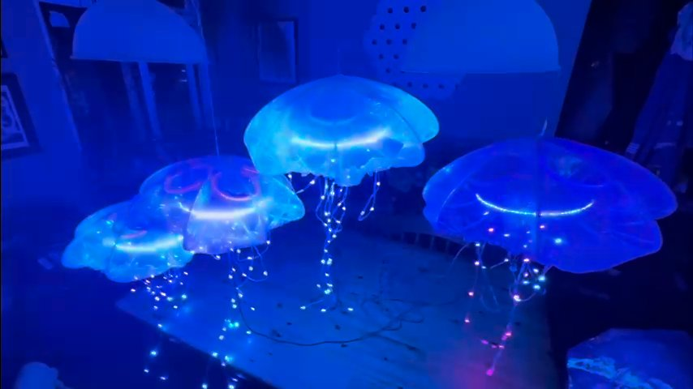

# The Sheffield-by-the-Sea EMF2026 audio-reactive light up Jellyfish! 
Everything you need to print parts, order circuit boards, and flash the firmware is here. 
There is an excellent write-up on the project over at [Pimoroni Learn](https://learn.pimoroni.com/article/building-sound-reactive-jellyfish)
